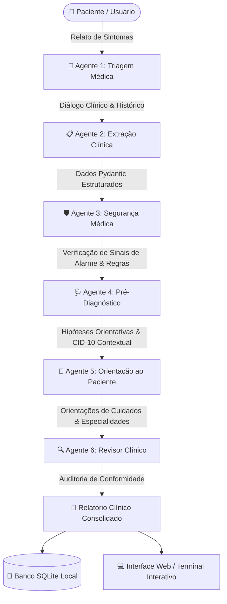

<div align="center">

# ⚕️ Asclépio

### Sistema Inteligente Multi-Agente para Triagem Médica Orientativa

[](https://python.org)
[](https://fastapi.tiangolo.com)
[](https://docs.pydantic.dev)
[](https://build.nvidia.com)
[](LICENSE)
[](.github/workflows/ci.yml)

<p align="center">
  <b>Triagem inteligente, extração clínica estruturada, regras determinísticas de segurança e orientação ao paciente.</b>
</p>

[Visão Geral](#-visão-geral) •
[Arquitetura Multi-Agente](#-arquitetura-multi-agente) •
[Funcionalidades](#-funcionalidades) •
[Início Rápido](#-início-rápido) •
[Execução](#-como-executar) •
[Deploy](#-deploy-na-nuvem) •
[Testes](#-testes) •
[Segurança Médica](#-segurança-e-ética)

---

</div>

> [!CAUTION]
> ### 🚨 AVISO MÉDICO E LEGAL IMPORTANTE
> O **Asclépio** é um assistente experimental de suporte e triagem orientativa preliminar. **Ele NÃO substitui uma consulta médica presencial, diagnóstico profissional ou exames laboratoriais.**
>
> 🚑 **Em caso de emergência ou sinais graves (dor no peito, falta de ar súbita, perda de consciência, sangramentos intensos), ligue imediatamente para o SAMU 192 ou dirija-se ao pronto-socorro mais próximo.**

---

## 📖 Visão Geral

O **Asclépio** foi desenvolvido para resolver o desafio de estruturar queixas clínicas e sintomas relatados por pacientes em linguagem natural, transformando relatos difusos em dados clínicos acionáveis, com rigorosas camadas de segurança para evitar alucinações de modelos de linguagem.

O sistema opera através de uma esteira colaborativa de agentes especializados baseados no modelo **Llama 3.3 70B Instruct** via **NVIDIA NIM** (ou OpenAI), complementado por um motor de validação determinística de segurança médica.

---

## 🏛️ Arquitetura Multi-Agente

O fluxo de atendimento segue uma cadeia sequencial com pontos de controle e validação de segurança (*Human-in-the-Loop*):



### Papéis dos Agentes:

| Agente | Responsabilidade | Saída |
| :--- | :--- | :--- |
| **1. Triagem Médica** | Conduz a anamnese inicial de forma empática e investigativa | Queixa principal, duração, intensidade |
| **2. Extração Clínica** | Estrutura dados não estruturados do diálogo | Modelo de dados normalizado (JSON/Pydantic) |
| **3. Segurança Médica** | Avalia deterministricamente termos de risco e sinais de alerta | Classificação de urgência (BAIXO, MODERADO, ALTO, CRÍTICO) |
| **4. Pré-Diagnóstico** | Levanta hipóteses diagnósticas orientativas plausíveis | Hipóteses prováveis e especialidades recomendadas |
| **5. Orientação** | Elabora condutas seguras e esclarecimentos ao paciente | O que fazer, quando procurar auxílio, o que evitar |
| **6. Revisor Clínico** | Filtra termos proibidos (automedicação, doses, diagnósticos taxativos) | Parecer de conformidade e liberação segura |

---

## ✨ Funcionalidades

- **Dupla Interface de Uso**:
  - 🖥️ **Web App**: Interface moderna, responsiva, com cards clínicos, seletor de intensidade de dor e histórico.
  - 📟 **Terminal com Rich**: Visualização detalhada no terminal com painéis formatados, tabelas e cores.
- **Camada Determinística de Segurança**:
  - Sinais de alarme (ex: dor torácica, rigidez de nuca, febre em recém-nascidos) elevam automaticamente o nível de urgência, independentemente do modelo de IA.
  - Bloqueio imediato de tratamentos caseiros perigosos ou pseudociências.
- **Rastreabilidade e Persistência**:
  - Armazenamento em SQLite (`data/asclepio.db`) de atendimentos e eventos de auditoria.
  - Exportação de relatórios em `.txt` para arquivamento ou encaminhamento.
- **Human-in-the-Loop (HITL)**:
  - Todo relatório gerado sinaliza a necessidade de revisão profissional.

---

## 🚀 Início Rápido

### Pré-requisitos

- Python 3.10 ou superior ([Download Python](https://www.python.org/downloads/))
- Uma chave de API gratuita do [NVIDIA API Catalog](https://build.nvidia.com/) ou da OpenAI

### 1. Clonar o Repositório

```bash
git clone https://github.com/marlonferreira1800-hue/asclepio.br.git
cd asclepio.br
```

### 2. Configurar o Ambiente Virtual

No Windows (PowerShell):
```powershell
python -m venv .venv
.\.venv\Scripts\Activate.ps1
pip install --upgrade pip
pip install -r requirements.txt
```

No Linux / macOS:
```bash
python3 -m venv .venv
source .venv/bin/activate
pip install --upgrade pip
pip install -r requirements.txt
```

### 3. Configurar as Variáveis de Ambiente

Copie o arquivo de exemplo:
```bash
cp .env.example .env
```

Edite o arquivo `.env` com seu editor favorito:
```env
NVIDIA_API_KEY=sua_chave_real_da_nvidia_aqui
NVIDIA_MODEL=meta/llama-3.3-70b-instruct
NVIDIA_BASE_URL=https://integrate.api.nvidia.com/v1
APP_NAME=Asclépio
```

---

## 💻 Como Executar

### Opção A: Servidor Web (Recomendado)

Inicie o servidor HTTP com interface web integrada:

```bash
python site_server.py 8001
```

Acesse no navegador:
👉 **[http://127.0.0.1:8001](http://127.0.0.1:8001)**

> No Windows, você também pode simplesmente dar duplo clique no atalho `asclepio_frontend.bat`.

### Opção B: Terminal Interativo

Para interagir diretamente pelo console com formatação rica:

```bash
python asclepio.py
```

Para consultar relatórios e atendimentos salvos:
```bash
python asclepio.py --relatorios
python asclepio.py --atendimentos
```

---

## ☁️ Deploy na Nuvem

O projeto possui suporte nativo para plataformas como **Render** e **Railway**:

- `Procfile`: Comando de inicialização web pronto.
- `render.yaml`: Definição de infraestrutura como código (IaC).
- `runtime.txt`: Versão do runtime Python.
- `/healthz`: Endpoint de verificação de integridade (*liveness probe*).

### Publicando no Render

1. Conecte o repositório no [Render](https://render.com/).
2. Crie um novo **Web Service**.
3. Configure a variável de ambiente secreta `NVIDIA_API_KEY`.
4. O Render detectará automaticamente o comando:
   ```bash
   python site_server.py
   ```

Consulte o passo a passo completo no guia [DEPLOY.md](DEPLOY.md).

---

## 🧪 Testes

O Asclépio possui uma suíte completa de testes unitários para validar regras de segurança clínica, esquemas Pydantic, revisor de termos e operações de banco de dados:

```bash
# Executar a suíte de testes integrada (sem dependências externas):
python tests/run_tests.py

# Ou com pytest:
pip install -r requirements-dev.txt
pytest -v tests/
```

---

## 📁 Estrutura do Repositório

```text
asclepio.br/
├── .github/
│   ├── workflows/           # Automação CI/CD e CodeQL
│   │   ├── ci.yml
│   │   └── codeql.yml
│   ├── ISSUE_TEMPLATE/      # Modelos de bugs e melhorias
│   └── PULL_REQUEST_TEMPLATE.md
├── frontend/                # Interface Web completa
│   ├── static/              # CSS modular, JS e ilustrações
│   │   ├── css/
│   │   ├── js/
│   │   └── assets/
│   ├── index.html           # Página principal da aplicação
│   ├── server.py            # API FastAPI do frontend
│   └── services.py          # Camada de serviços web
├── tests/                   # Suíte de testes unitários
│   ├── conftest.py
│   ├── run_tests.py         # Test runner independente
│   ├── test_clinical_tools.py
│   ├── test_database.py
│   ├── test_reviewer.py
│   ├── test_safety.py
│   └── test_schemas.py
├── agents.py                # Ponto de acesso aos agentes
├── asclepio.py              # CLI principal em terminal
├── client.py                # Cliente de integração LLM (NVIDIA/OpenAI)
├── clinical_tools.py        # Ferramentas e cálculo de confiança clínica
├── config.py                # Configurações e variáveis de ambiente
├── database.py              # Persistência SQLite local
├── extraction_agent.py      # Agente de extração clínica
├── interface.py             # Renderização Rich para terminal
├── knowledge.py             # Base de conhecimento e diretrizes
├── memory.py                # Memória contextual da sessão
├── observability.py         # Registro de auditoria de eventos
├── orientation_agent.py     # Agente de orientação ao paciente
├── prediagnosis_agent.py    # Agente de pré-diagnóstico orientativo
├── prompts.py               # Prompts de sistema com guardrails
├── reports.py               # Geração e exportação de relatórios
├── reviewer.py              # Validador de segurança do relatório
├── safety.py                # Regras determinísticas de urgência
├── safety_agent.py          # Agente de análise de segurança médica
├── schemas.py               # Modelos Pydantic de validação
├── site_server.py           # Servidor web leve e standalone
├── state.py                 # Máquina de estados da triagem
├── triage_agent.py          # Agente conversacional de triagem
├── triage_constants.py      # Constantes e sinais de alerta
├── CONTRIBUTING.md          # Diretrizes para colaboradores
├── CODE_OF_CONDUCT.md       # Código de conduta
├── DEPLOY.md                # Guia de implantação em produção
├── LICENSE                  # Licença MIT
├── pyproject.toml           # Metadados de empacotamento Python
├── requirements.txt         # Dependências de produção
├── requirements-dev.txt     # Dependências de desenvolvimento
└── SECURITY.md              # Política de segurança e ética médica
```

---

## 🔒 Segurança e Ética

- **Anti-Alucinação**: A camada de revisão sintática e semântica intercepta respostas que contenham prescrições com doses específicas ou diagnósticos fechados.
- **Privacidade por Padrão**: As variáveis confidenciais residem exclusivamente no `.env` e nunca são transmitidas para a interface do cliente.
- **Rastreamento de Decisões**: Cada decisão e pontuação de confiança gerada pelo sistema é persistida com carimbo de data e hora para auditoria.

---

## 🤝 Como Contribuir

Contribuições são muito bem-vindas! Por favor, leia o nosso [Guia de Contribuição](CONTRIBUTING.md) e o [Código de Conduta](CODE_OF_CONDUCT.md) antes de enviar um Pull Request.

---

## 📄 Licença

Este projeto está sob a licença **MIT** - consulte o arquivo [LICENSE](LICENSE) para obter mais detalhes.

Desenvolvido por **[Marlon Ferreira](https://github.com/marlonferreira1800-hue)**.
